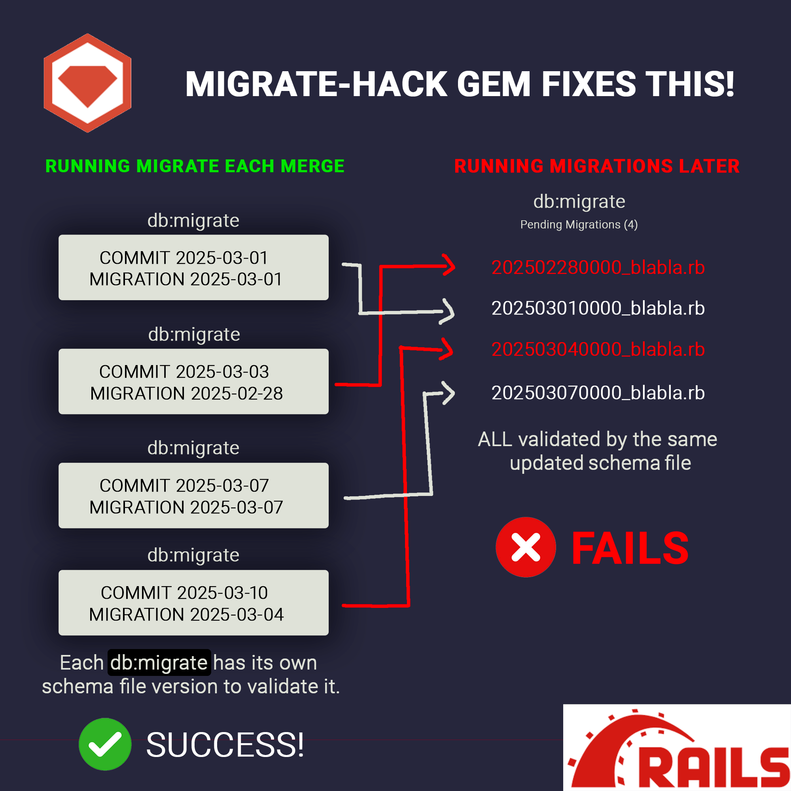

# Migrate Hack

[](https://badge.fury.io/rb/migrate-hack)

---



---
⚠️ **Warning:**  
This gem checks out previous commits to run migrations, then restores everything back to normal.
**Do not run it on servers that are actively serving the application. Run it in parallel.**

---

[Installation](#installation) | [Usage](#usage) | [Changelog](CHANGELOG.md)

---

## Installation

You can install migrate-hack via RubyGems:

```bash
gem install migrate-hack
```

Alternatively, add it to your Gemfile:

```ruby
gem 'migrate-hack'
```

Then run:

```bash
bundle install
```

---

## Usage

Once installed, the executable `migrate-hack` will be available in your PATH. Use it with the following options:

### Command-Line Arguments

- **`--env [FILE]`**  
  Specifies the path to a `.env` file that will be sourced to load environment variables. This is useful when your migration process depends on specific configuration settings.

  **Example:**
  ```bash
  migrate-hack --env tmp/.env
  ```

- **`--copy [DIR]`**  
  Specifies a directory whose contents will be copied into the project’s directory structure before running migrations. **Important:**  
  - The files within the folder defined by `--copy` must follow the same folder structure as they belong in your project. For example, if you need to override credential files located in `config/credentials/`, the `--copy` directory should contain a `config/credentials/` folder with the appropriate files.
  - This option is particularly useful for updating credentials or other configuration files that are not synchronized with your repository.

  **Example:**
  ```bash
  migrate-hack --copy tmp/untracked/
  ```

### Combined Example

To run migrations while loading environment variables from `tmp/.env` and copying necessary files (ensuring the correct folder structure) from `tmp/untracked/`, execute:

```bash
migrate-hack --env tmp/.env --copy tmp/untracked/
```

---

## Conflicts

Essentially, migration conflicts occur when the schema file is updated but still validates old migrations. This process requires columns that haven’t yet been created, leading to various inconsistencies.

To resolve this, the migration should run with the schema version that was in place when it was created and with the same gems that influenced the Rails build at that time. For this purpose, we use git as a time machine—revisiting the last commit for that migration and running it as if going back in time.

---

## Args

- **(`--env`):**  
  Load a specified `.env` file to provide the necessary environment variables during the migration process.

- **(`--copy`):**  
  Copy the files from a designated directory into the project before running migrations. This is especially useful for overriding credentials or configuration files that are not stored in the repository.

---

## Git Handling
  For each pending migration, the tool:
  - Checks out the commit where the migration was introduced,
  - Installs necessary dependencies,
  - Runs the migration,
  - And then returns to the main branch.

---

## Dependencies

- **Git:**  
  migrate-hack relies on Git to retrieve commit information and perform checkouts. **Ensure that Git is installed** and available in your system’s PATH.

- **Ruby and Bundler:**  
  Ruby (and Bundler) are required for installing the gem and running Rails commands.

- **Bash:**  
  The tool uses a shell script as part of its logic, so a compatible Bash interpreter is required.

---

## Repository State

For migrate-hack to work correctly, the repository must be in a clean state (with no uncommitted changes). This ensures that Git operations (such as stashing, checking out commits, and reverting to the main branch) function as expected. Before running the tool, commit or stash any changes in your repository.

---

## Contributing

Contributions are welcome! Please open issues or submit pull requests on our [GitHub repository](https://github.com/omelao/migrate-hack).

## License

migrate-hack is licensed under the MIT License. See the [LICENSE](LICENSE) file for details.

---

